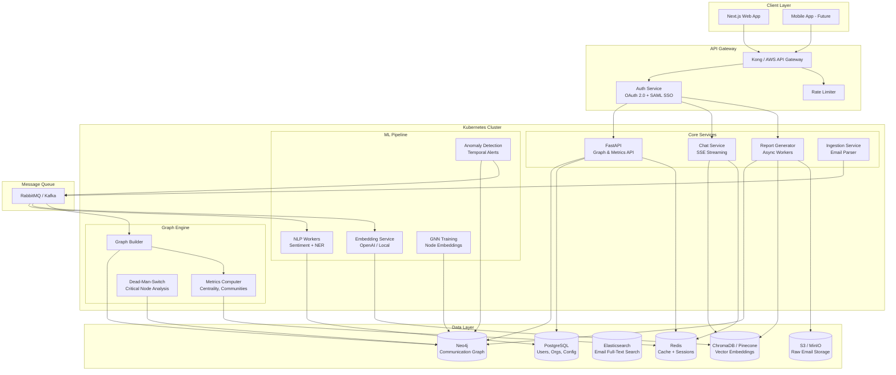
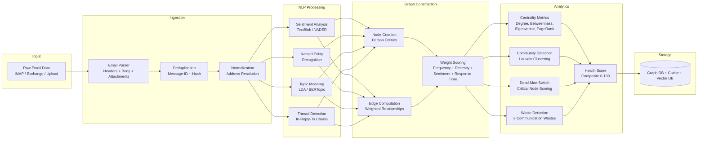
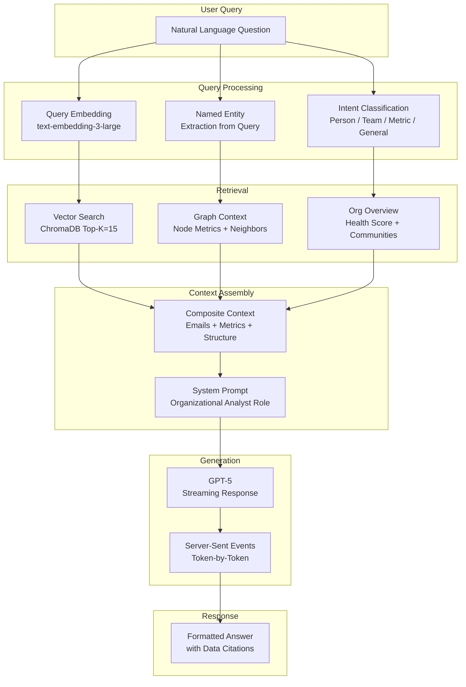
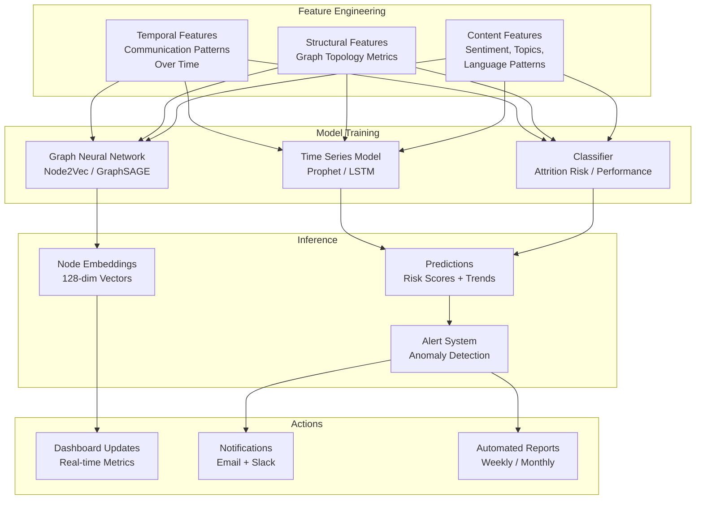
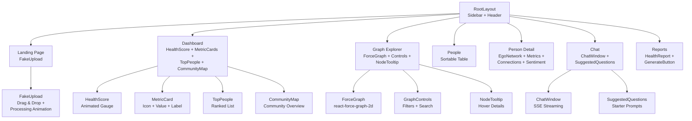

# OrgVitals — Production Architecture

## 1. System Architecture (Production Vision)

## 2. Data Pipeline

## 3. GraphRAG Architecture

## 4. ML Pipeline (Future)

## 5. Frontend Component Tree

